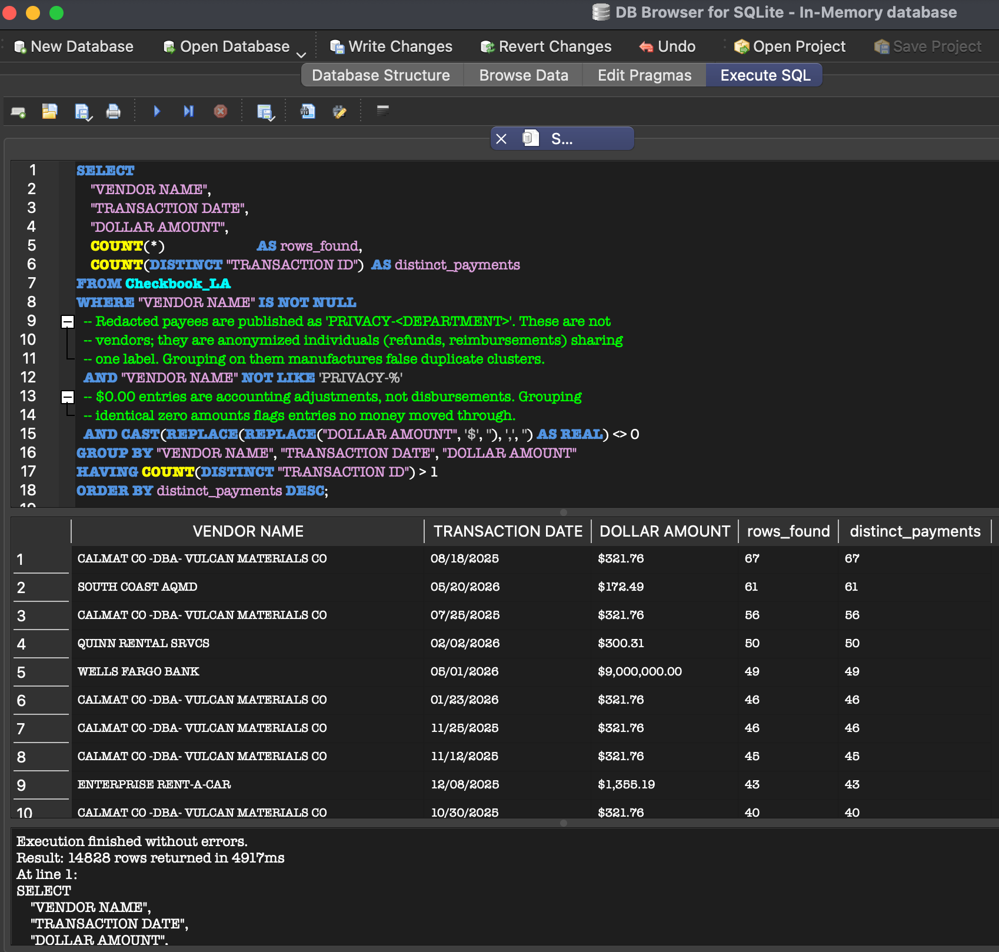
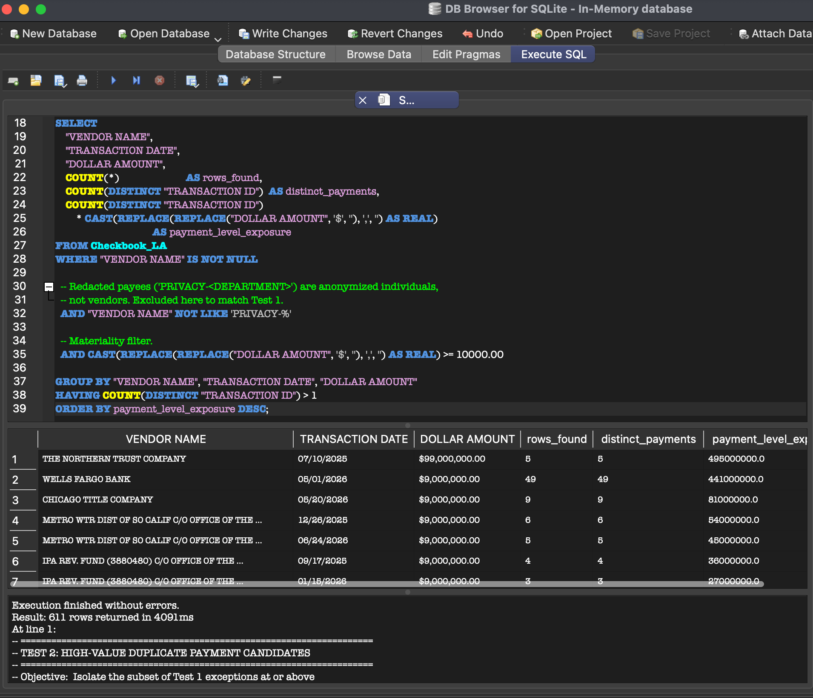
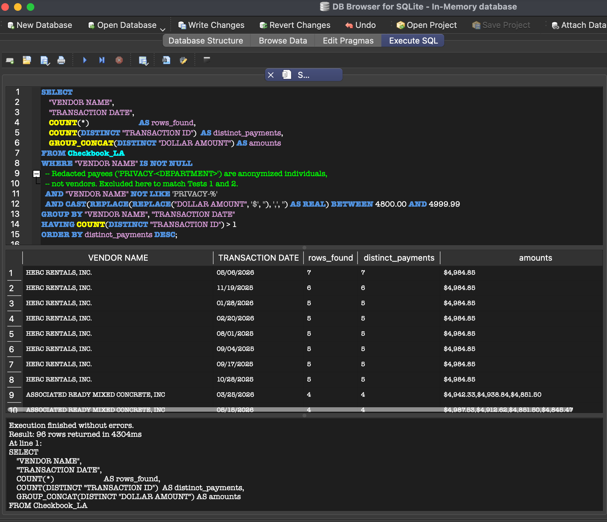
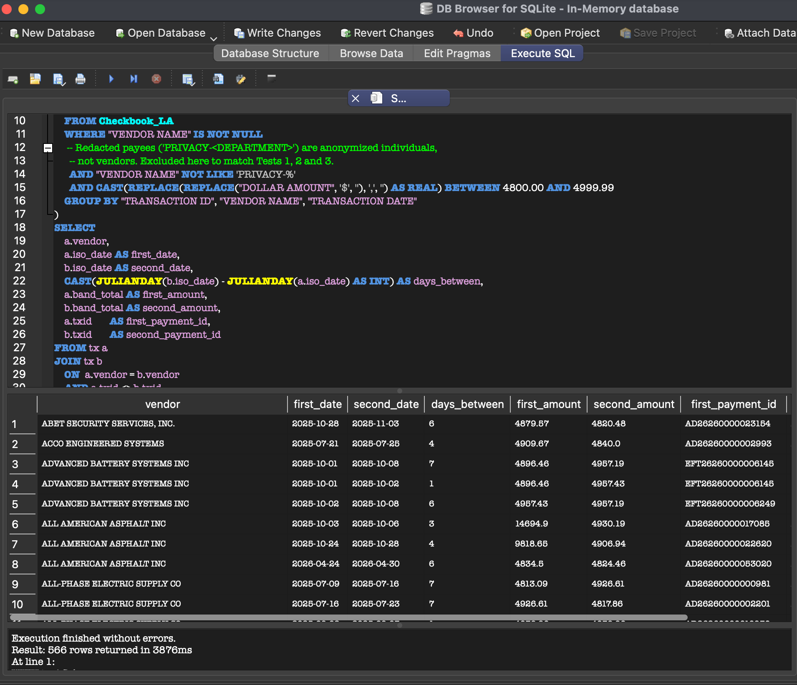
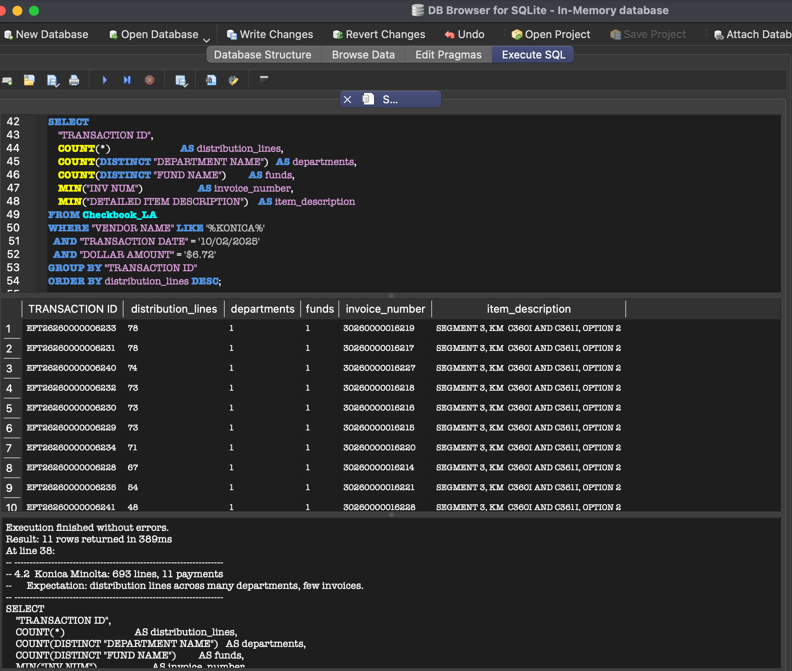
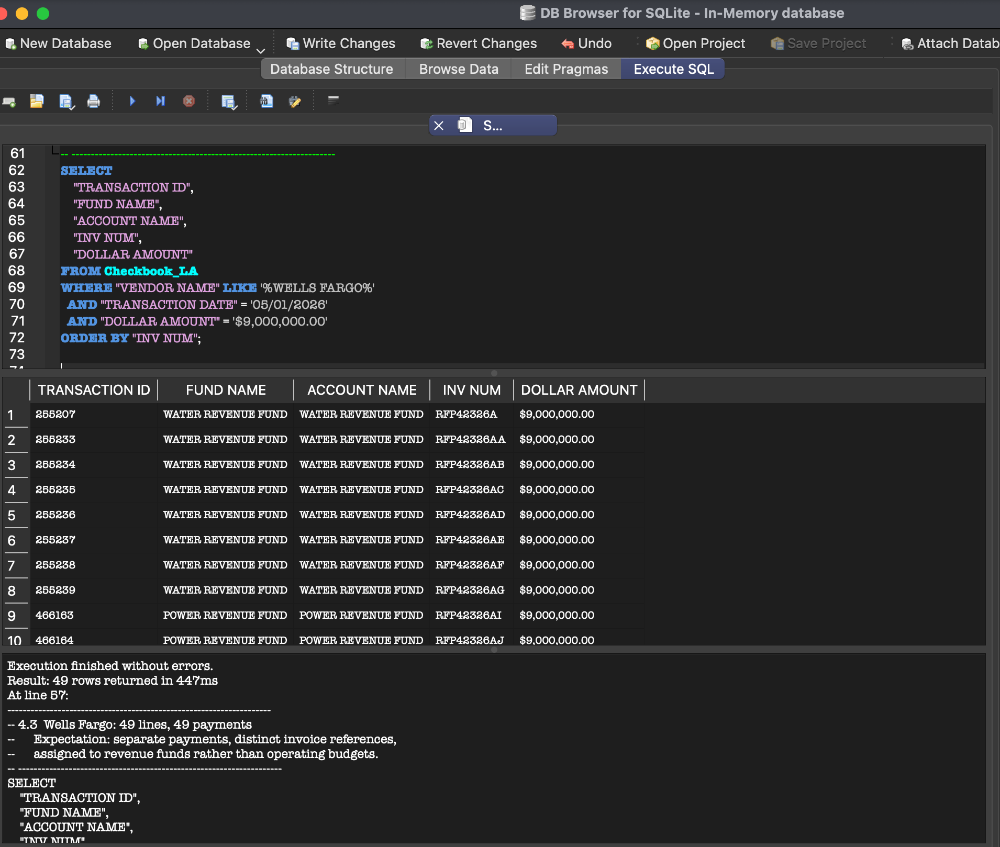
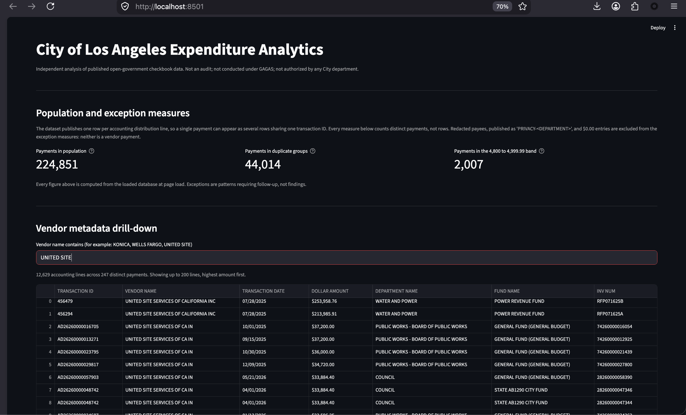

# City of Los Angeles Expenditure Data Analytics
**Exception Testing & Substantive Drill-Down using SQLite**

> **Scope & Disclaimer Note:** This is an independent data analysis of published open-government expenditure data. It is **not** an audit, was not conducted under Generally Accepted Government Auditing Standards (GAGAS), and was not authorized, sponsored, or reviewed by any City of Los Angeles department. Conclusions are strictly limited to what the published metadata fields support.

---

## Executive Summary

Public expenditure datasets contain repeating line items and high-dollar totals that trigger automated exception flags. Without accounting context, those flags are easily mischaracterized. This project applies deterministic exception tests to the **City of Los Angeles Checkbook dataset** using SQLite, then drills into the largest exceptions to establish what the published metadata can and cannot explain.

The most consequential results were not exceptions. They were two defects found in the tests themselves: the first version **counted accounting lines as though they were payments**, and the corrected version then **grouped redacted payees as though they were vendors**. Fixing both removed roughly three-quarters of the exceptions originally reported.

### Principal Conclusion

**The dataset contains 747,363 accounting lines representing 224,851 distinct payments — an average of 3.32 lines per payment. Counting at the payment level and excluding redacted payees and zero-dollar entries, the exception tests returned 14,828 duplicate-payment groups, 611 high-value groups at or above $10,000, 96 same-day sub-threshold clusters, and 566 threshold-adjacent payment pairs inside a seven-day window. Two exceptions were then examined against department, fund, account and invoice metadata: the largest by count dissolved into 11 payments published across 693 accounting lines, while the largest by dollar value proved to be 49 genuinely separate payments, explained by the fund and invoice metadata as institutional debt service. No control weakness, overpayment, or non-compliance is asserted by this analysis.**

---

## Key Methodological Finding: Lines Are Not Payments

The City publishes each payment as **one row per accounting distribution line**. A single invoice charged against six funds appears as six rows with the same vendor, date and amount. The schema's own `INV LINE` and `INVOICE DISTRIBUTION LINE` fields corroborate this.

A duplicate-payment test that groups on vendor, date and amount therefore flags the City's own accounting structure as if it were duplicate spending.

The correction is to count distinct values of `TRANSACTION ID` rather than rows, and to flag a group only when the same vendor, date and amount appear under **two or more different transaction IDs**:

```sql
-- Original: counts accounting lines
HAVING COUNT(*) > 1

-- Corrected: counts payments
HAVING COUNT(DISTINCT "TRANSACTION ID") > 1
```

Effect of the correction on Test 1:

| Measure | Counting lines | Counting payments |
| :--- | ---: | ---: |
| Exception groups | 59,482 | 18,973 |
| Transactions involved | 230,675 | 63,853 |
| Share of population | 30.9% of 747,363 lines | 28.4% of 224,851 payments |

**68% of the groups the original test reported were artefacts of the data's structure**, not candidate duplicates. Every figure below is stated at the payment level.

---

## Second Methodological Finding: Redacted Payees Are Not Vendors

Correcting the unit of analysis exposed a second defect. The largest groups remaining in Test 1 were not vendors at all:

| Grouped "vendor" | Payments | Amount |
| :--- | ---: | ---: |
| `PRIVACY-LOS ANGELES HOUSING` | 435 | $31.05 |
| `PRIVACY-POLICE` | 340 | $650.00 |
| `PRIVACY-FIRE` | — | — |
| `PRIVACY-RECREATION AND PARKS` | — | — |

The City redacts individual payees — resident refunds, employee reimbursements — and republishes them under a shared department label. Grouping on that label collapses hundreds of unrelated individuals into one "vendor" and manufactures duplicate clusters that do not exist.

Zero-dollar entries create the same problem: identical `$0.00` amounts group together, but no money moved.

Both are excluded, with the reasoning recorded in the query rather than in a commit message:

```sql
  -- Redacted payees are published as 'PRIVACY-<DEPARTMENT>'. These are not
  -- vendors; they are anonymized individuals (refunds, reimbursements) sharing
  -- one label. Grouping on them manufactures false duplicate clusters.
  AND "VENDOR NAME" NOT LIKE 'PRIVACY-%'

  -- $0.00 entries are accounting adjustments, not disbursements.
  AND CAST(REPLACE(REPLACE("DOLLAR AMOUNT", '$', ''), ',', '') AS REAL) <> 0
```

Effect on Test 1:

| Stage | Exception groups |
| :--- | ---: |
| Counting accounting lines | 59,482 |
| Counting payments | 18,973 |
| Excluding redacted payees | 14,893 |
| Excluding zero-dollar entries | **14,828** |

**Three quarters of the original result was an artefact of how the data is published**, not a property of the payments.

---

## Dataset Scope & Population Scale

* **Published rows:** 747,363 accounting lines from the **Checkbook L.A. Data** table.
* **Distinct payments:** 224,851, identified by `TRANSACTION ID` — a ratio of 3.32 lines per payment.
* **Population:** All records carrying `FISCAL YEAR` 2026 — a single fiscal year, filtered at the source. No sampling.
* **Transaction dates:** 5 December 2024 to 30 June 2026. Dates precede the fiscal year because `TRANSACTION DATE` records the document date, not the date the payment was booked: 38 lines (14 payments) carry 2024 dates inside a fiscal 2026 extract. This confirms directly that the date field cannot be read as a payment execution date — see limitations below.
* **Key fields analyzed:** Transaction ID, Vendor Name, Transaction Date, Dollar Amount, Department Name, Fund Name, Account Name, PO Number, Invoice Number, Detailed Item Description.

---

## Repository Structure

```text
la-city-expenditure-analytics/
├── assets/
│   ├── 01_duplicate_payment_test.png   # Duplicate payment test output
│   ├── 02_high_value_anomaly_test.png  # Materiality threshold test output
│   ├── 03_sub_materiality_test.png     # Same-day sub-threshold test output
│   ├── 03b_rolling_window_test.png     # 7-day rolling window test output
│   ├── 04_konica_line_split.png        # One payment across 78 accounting lines
│   ├── 04_wells_fargo_drilldown.png    # Debt service fund and invoice metadata
│   └── 04_dashboard.png                # Exception review interface
├── 01_duplicate_payment_test.sql       # Duplicate payment scanner (payment-level)
├── 02_high_value_anomaly_test.sql      # Materiality filter ($10k+ per payment)
├── 03_sub_materiality_structuring_test.sql # Same-day sub-threshold clusters
├── 03b_rolling_window_structuring.sql      # 7-day rolling window scanner
├── 04_substantive_drill_down.sql       # Metadata drill-downs for the largest exceptions
├── app.py                              # Streamlit exception review interface
├── requirements.txt                    # Python dependencies
├── .gitignore                          # Excludes the local database and raw CSV
└── README.md                           # This file
```

---

## Exception Tests

### Test 1: Duplicate Payment Scanner (`01_duplicate_payment_test.sql`)

Flags the same vendor, date and amount appearing under more than one transaction ID, excluding redacted payees and zero-dollar entries.

```sql
SELECT "VENDOR NAME", "TRANSACTION DATE", "DOLLAR AMOUNT",
       COUNT(*) AS rows_found,
       COUNT(DISTINCT "TRANSACTION ID") AS distinct_payments
FROM Checkbook_LA
WHERE "VENDOR NAME" IS NOT NULL
  AND "VENDOR NAME" NOT LIKE 'PRIVACY-%'
  AND CAST(REPLACE(REPLACE("DOLLAR AMOUNT", '$', ''), ',', '') AS REAL) <> 0
GROUP BY "VENDOR NAME", "TRANSACTION DATE", "DOLLAR AMOUNT"
HAVING COUNT(DISTINCT "TRANSACTION ID") > 1
ORDER BY distinct_payments DESC;
```

* **Result:** 14,828 exception groups covering **44,014 distinct payments** — 19.6% of the 224,851 payments in the population.
* **Largest groups:** aggregate and equipment suppliers paid an identical per-unit price many times in one day — for example 67 payments of $321.76 to a construction materials vendor. A per-load or per-unit price repeated across deliveries produces this pattern with no irregularity of any kind.
* **Interpretation:** At this scale the test is a screening filter, not a finding. Recurring obligations of identical value — rent, licences, per-unit service charges — are expected to repeat.



---

### Test 2: High-Value Materiality Filter (`02_high_value_anomaly_test.sql`)

The same test restricted to payments of $10,000 or more. Currency is stored as formatted text and is cast to a numeric type.

Exposure is computed as **distinct payments × amount**, not as a sum over rows. Summing rows would re-introduce the line-counting error inside the aggregate.

```sql
SELECT "VENDOR NAME", "TRANSACTION DATE", "DOLLAR AMOUNT",
       COUNT(*)                         AS rows_found,
       COUNT(DISTINCT "TRANSACTION ID") AS distinct_payments,
       COUNT(DISTINCT "TRANSACTION ID")
           * CAST(REPLACE(REPLACE("DOLLAR AMOUNT", '$', ''), ',', '') AS REAL)
                                        AS payment_level_exposure
FROM Checkbook_LA
WHERE "VENDOR NAME" IS NOT NULL
  AND "VENDOR NAME" NOT LIKE 'PRIVACY-%'
  AND CAST(REPLACE(REPLACE("DOLLAR AMOUNT", '$', ''), ',', '') AS REAL) >= 10000.00
GROUP BY "VENDOR NAME", "TRANSACTION DATE", "DOLLAR AMOUNT"
HAVING COUNT(DISTINCT "TRANSACTION ID") > 1
ORDER BY payment_level_exposure DESC;
```

* **Result:** 611 exception groups.
* **Relationship to Test 1:** A materiality-filtered subset of Test 1, not additional exceptions. Not additive.
* **Top two by exposure:** The Northern Trust Company — 5 payments of $99,000,000 on 07/10/2025, $495,000,000 — and Wells Fargo Bank — 49 payments of $9,000,000 on 05/01/2026, $441,000,000. Both are financial institutions, and payments of that size to a bank are consistent with debt service or trustee transfers rather than vendor purchasing. Their position at the top reflects a property of the test: it cannot distinguish a repeated bond payment from a repeated invoice.
* **Why this matters:** 611 groups is a population a reviewer could work through. That is the practical value of filtering by materiality after correcting the unit of analysis.



---

### Test 3: Same-Day Sub-Threshold Clusters (`03_sub_materiality_structuring_test.sql`)

Flags vendors paid more than once on the same day in the $4,800.00–$4,999.99 band, immediately below a commonly used $5,000 approval threshold.

```sql
SELECT "VENDOR NAME", "TRANSACTION DATE",
       COUNT(*)                         AS rows_found,
       COUNT(DISTINCT "TRANSACTION ID") AS distinct_payments,
       GROUP_CONCAT(DISTINCT "DOLLAR AMOUNT") AS amounts
FROM Checkbook_LA
WHERE "VENDOR NAME" IS NOT NULL
  AND "VENDOR NAME" NOT LIKE 'PRIVACY-%'
  AND CAST(REPLACE(REPLACE("DOLLAR AMOUNT", '$', ''), ',', '') AS REAL) BETWEEN 4800.00 AND 4999.99
GROUP BY "VENDOR NAME", "TRANSACTION DATE"
HAVING COUNT(DISTINCT "TRANSACTION ID") > 1
ORDER BY distinct_payments DESC;
```

* **Result:** 96 exception groups.
* **Largest clusters:** an equipment rental vendor paid 7, 6 and repeatedly 5 times in a single day at $4,984.85 — genuinely distinct transaction IDs, within $16 of the threshold. This is the clearest candidate the test produces, and it is a candidate only: separate rental contracts at a standard daily or weekly rate would look identical.
* **Threshold caveat:** $5,000 is a commonly used approval threshold and is used here as a working assumption. The applicable City threshold, and the rules on aggregating related purchases, would need to be confirmed against the Administrative Code before any conclusion about threshold evasion.
* **Limitation:** Same-day splits only. Test 3b extends the window.



---

### Test 3b: Multi-Day Rolling Window (`03b_rolling_window_structuring.sql`)

The same band, paired across a 7-day window for the same vendor. Dates are reconstructed into ISO format so `JULIANDAY` arithmetic works, and the band is aggregated to the payment level inside the CTE before the self-join.

```sql
WITH tx AS (
    SELECT
        "TRANSACTION ID" AS txid,
        "VENDOR NAME"    AS vendor,
        SUBSTR("TRANSACTION DATE", 7, 4) || '-' ||
        SUBSTR("TRANSACTION DATE", 1, 2) || '-' ||
        SUBSTR("TRANSACTION DATE", 4, 2) AS iso_date,
        COUNT(*) AS band_lines,
        SUM(CAST(REPLACE(REPLACE("DOLLAR AMOUNT", '$', ''), ',', '') AS REAL)) AS band_total
    FROM Checkbook_LA
    WHERE "VENDOR NAME" IS NOT NULL
      AND "VENDOR NAME" NOT LIKE 'PRIVACY-%'
      AND CAST(REPLACE(REPLACE("DOLLAR AMOUNT", '$', ''), ',', '') AS REAL) BETWEEN 4800.00 AND 4999.99
    GROUP BY "TRANSACTION ID", "VENDOR NAME", "TRANSACTION DATE"
)
SELECT a.vendor, a.iso_date AS first_date, b.iso_date AS second_date,
       CAST(JULIANDAY(b.iso_date) - JULIANDAY(a.iso_date) AS INT) AS days_between,
       a.band_total AS first_amount, b.band_total AS second_amount,
       a.txid AS first_payment_id, b.txid AS second_payment_id
FROM tx a
JOIN tx b ON a.vendor = b.vendor
         AND a.txid <> b.txid
         AND JULIANDAY(b.iso_date) - JULIANDAY(a.iso_date) BETWEEN 1 AND 7
ORDER BY a.vendor, a.iso_date;
```

* **Result:** 566 payment pairs. A payment can pair with several others, so the pair count exceeds the number of payments involved.
* **Population context:** 2,007 payments fall in the $4,800–$4,999.99 band in total, which is the denominator this test screens against.



---

## Technical Notes: Four Notes on Getting the Numbers Right

### 1. A query that silently returned nothing

The first run of the rolling-window query returned **0 rows** after 5,254 ms. `JULIANDAY()` requires ISO dates (`YYYY-MM-DD`); the dataset stores US-format text (`MM/DD/YYYY`). `JULIANDAY('10/28/2025')` returns `NULL`, so every date comparison evaluated to `NULL` and no rows matched — with no error raised.

A test that cannot detect what it is designed to detect looks identical to a test that found nothing. The fix reconstructs the date inside a CTE:

```sql
SUBSTR("TRANSACTION DATE", 7, 4) || '-' ||
SUBSTR("TRANSACTION DATE", 1, 2) || '-' ||
SUBSTR("TRANSACTION DATE", 4, 2) AS iso_date
```

### 2. The wrong unit of analysis

The first version of every test counted rows. As set out above, rows are accounting lines, not payments. The error was found by tracing a published figure back to the database and getting a different answer — the totals in an earlier draft of this README did not reconcile to the data they claimed to describe.

The same error recurred inside an aggregate: `SUM()` over rows in Test 2 inflated exposure wherever a payment spanned multiple lines. Correcting `HAVING` is not sufficient if the summary columns still count rows.

### 3. Grouping on a redaction label

Once payments were counted correctly, the largest remaining groups were `PRIVACY-<DEPARTMENT>` labels rather than vendors. The test was grouping hundreds of unrelated individuals into a single entity. Identifying this required reading the output rather than only the row count.

These first three failures share a property: **none produced an error message.** One returned zero rows that looked like a clean result; the others returned inflated counts that looked plausible. Reconciling every reported figure to a re-run query, and reading the top of every result set, is what surfaced them.

### 4. The parts did not add up to the whole

Distinct payments counted by calendar year — 14 in 2024, 111,840 in 2025,
113,086 in 2026 — total 224,940. The population is 224,851. The parts
exceed the whole by 89.

This is not an error. `COUNT(DISTINCT "TRANSACTION ID")` counts an ID once
within each group, so a payment whose accounting lines carry dates in two
calendar years is counted in both. Queried directly, exactly 89 payments
carry lines in more than one calendar year — matching the arithmetic gap,
which also establishes that each spans exactly two years rather than three.

The substantive point is that `TRANSACTION DATE` is a line-level attribute:
one payment can carry more than one date. Test 1 groups on vendor, date and
amount, so a straddling payment is split across groups. Because the test
flags only where two or more distinct transaction IDs share a group, this
cannot create a false positive; at worst it suppresses one. 89 of 224,851
is 0.04% of the population.

Found by adding up a column and noticing the total did not match.

---

## Substantive Metadata Drill-Downs

### Case Study 1: Konica Minolta — one payment across dozens of accounting lines

* **Flagged:** $6.72 appearing on 693 rows dated 10/02/2025, totalling $4,656.96.
* **Resolved:** those 693 rows carry only **11 distinct transaction IDs**. Individual payments are published across 48 to 78 accounting lines each. Every one of the 11 shows a single department and a single fund, so the split is across accounting lines within one budget, not across departments. The item description identifies specific device models under one contract segment, which is consistent with per-device billing for shared printing equipment.
* **Why it is included:** this is the line-versus-payment finding made visible in a single vendor. The same pattern repeats at other per-unit rates on the same date.
* *Not verified against master invoices or device logs, which published data does not contain.*



### Case Study 2: Wells Fargo — institutional debt service

* **Flagged:** $9,000,000.00 appearing 49 times on 05/01/2026, totalling $441,000,000.
* **Resolved:** 49 rows carrying **49 distinct transaction IDs** — genuinely separate payments, and the case that survived the payment-level correction unchanged. `FUND NAME`, `ACCOUNT NAME` and `INV NUM` assign them to Water and Power Revenue funds against distinct institutional treasury references in one numbered series. The metadata is consistent with authorized bond principal and interest redemptions through a trustee.
* *Not verified against trustee indentures or wire confirmations, which published data does not contain.*



---

## Summary of Analytical Findings

| Vendor | Flagged as | Rows | Distinct payments | Exposure | Resolution |
| :--- | :--- | ---: | ---: | ---: | :--- |
| **Northern Trust** | 5 same-day $99M transactions | 5 | **5** | $495,000,000.00 | **Screening output:** a financial institution at the top of a test that cannot separate debt service from vendor purchasing. |
| **Wells Fargo Bank** | 49 same-day $9M transactions | 49 | **49** | $441,000,000.00 | **Explained by data:** metadata consistent with authorized debt service and bond redemptions. Genuinely separate payments. |
| **Konica Minolta** | 693 duplicate $6.72 entries | 693 | **11** | $4,656.96 | **Artefact of line-level counting:** 11 payments allocated across dozens of accounting lines each. |

The largest exception by count dissolved once payments were counted instead of lines. The largest by dollar value did not — and is explained by the metadata rather than dismissed by it.

---

## Interactive Exception Review Interface

A Streamlit application connecting to the local SQLite database (`ap_data.db`). It allows a reviewer to search vendor lines and cross-reference department, account, fund and invoice metadata without writing SQL. All displayed measures are computed from the database at page load; none are hard-coded.

The interface reports the same exclusions as the SQL tests, so the dashboard and the queries cannot disagree.

### Handling schema drift and date parsing

Two problems surfaced during local deployment, both common in raw open data.

**Schema drift.** The import altered the casing of table and column names and left trailing spaces in some headers (`"VENDOR NAME "` rather than `"VENDOR NAME"`), so hard-coded references failed. The app runs `PRAGMA table_info` at startup and matches column names case- and whitespace-insensitively.

**Date parsing.** Dates are reconstructed into ISO format with `SUBSTR` inside a CTE at query time, for the reason described above.



---

## What This Open Dataset Cannot Show

1. **Approval workflows** — no sign-off timestamps, secondary approval logs, or delegated authority thresholds.
2. **Source documents** — no invoices, receipts, or cancelled check images.
3. **Contract files** — no contract language, bidding specifications, or amendment histories.
4. **Accounting timestamps** — no distinction between posting date and payment execution date.
5. **Applicable thresholds** — the approval and competitive-bidding limits in force, and the rules for aggregating related purchases.
6. **Payee identity where redacted** — refunds and reimbursements to individuals are published under a department label, so no test can treat them as entities.

Any conclusion about whether a control failed would require all six.

---

## How to Execute Locally

### Prerequisites
* SQLite3, or a visual editor such as **DB Browser for SQLite**.
* The **Checkbook L.A. Data** dataset, published by the Office of the Controller
  and downloaded from [controllerdata.lacity.org](https://controllerdata.lacity.org/Purchasing/Checkbook-L-A-Data/pggv-e4fn/data_preview),
  loaded as table `Checkbook_LA` inside `ap_data.db`.

### SQL exception tests
```bash
sqlite3 ap_data.db < 01_duplicate_payment_test.sql
sqlite3 ap_data.db < 02_high_value_anomaly_test.sql
sqlite3 ap_data.db < 03_sub_materiality_structuring_test.sql
sqlite3 ap_data.db < 03b_rolling_window_structuring.sql
sqlite3 ap_data.db < 04_substantive_drill_down.sql
```

### Review interface
Requires Python 3.9 or later:
```bash
pip install -r requirements.txt
streamlit run app.py
```

The database and raw CSV are excluded by `.gitignore` because of their size.

---

## Key Takeaways

1. **Establish the unit of analysis before writing the test.** A duplicate-payment test that counts accounting lines reports the publisher's file structure as a control weakness. Correcting this removed 68% of the exceptions.
2. **Fixing the test is not the same as fixing the summary.** The row-counting error survived in a `SUM()` column after the `HAVING` clause had been corrected.
3. **Read the output, not only the row count.** The redacted-payee defect was invisible in the count and obvious in the first four rows.
4. **Silent failures are the real risk.** A query returning zero rows because of a type mismatch is indistinguishable from a clean result. None of the failures recorded here raised an error.
5. **Exceptions are screening output, not findings.** 44,014 payments is a filter. 611 groups is a workload. Neither is evidence of anything until the metadata is examined.
6. **State the boundaries.** Every drill-down here records what was not verified, and why the published data could not verify it.

---

## About This Project

Built by **Chaitanya Yarlagadda, EA** — IRS Enrolled Agent, CPA candidate,
B.Tech in Computer Science — as independent preparation for performance
audit work.

The intent was not to find something wrong in the City's payments. It was
to learn what exception testing can and cannot establish from published
data, and to practise the discipline of reconciling every stated figure
back to the query that produced it. Two methodology errors surfaced that
way, and both are documented above rather than quietly corrected.

Data published by the Office of the Controller, City of Los Angeles.
Independent work, not affiliated with or reviewed by the City.

github.com/y-chaitanya
