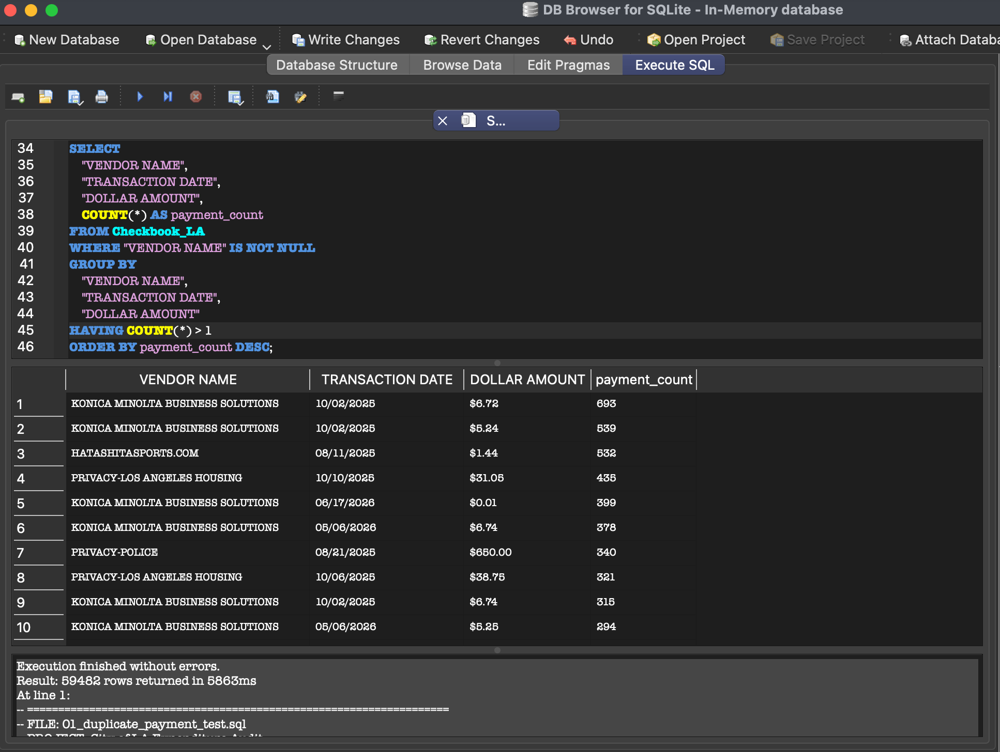
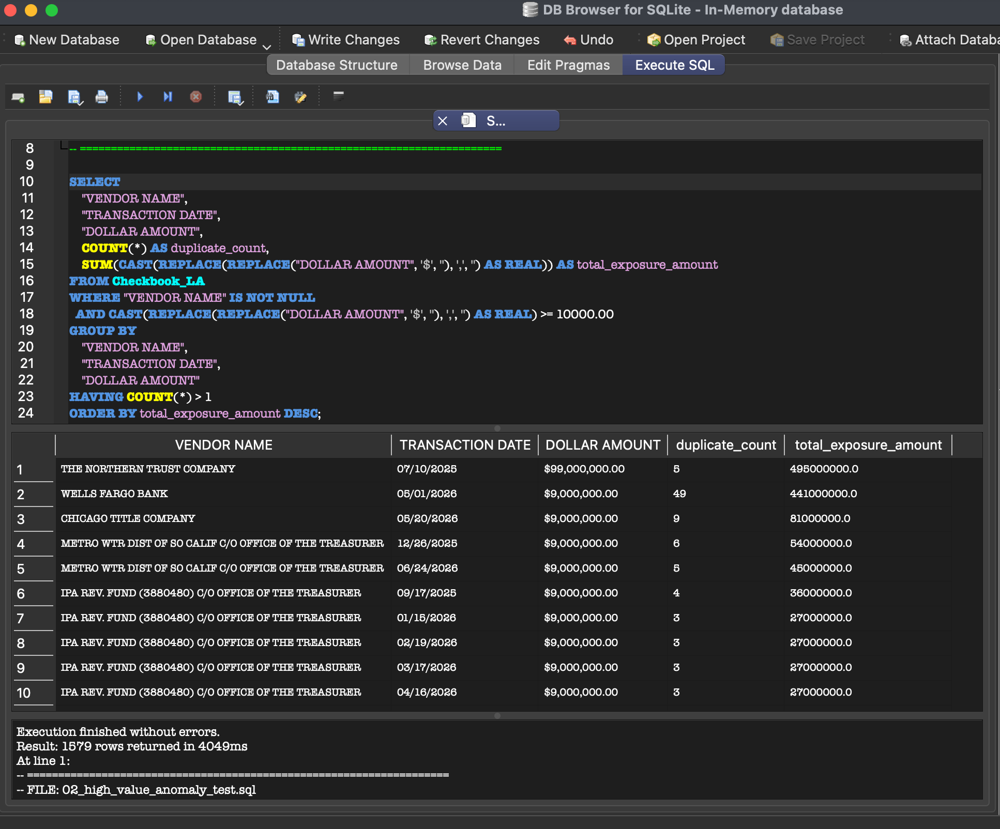
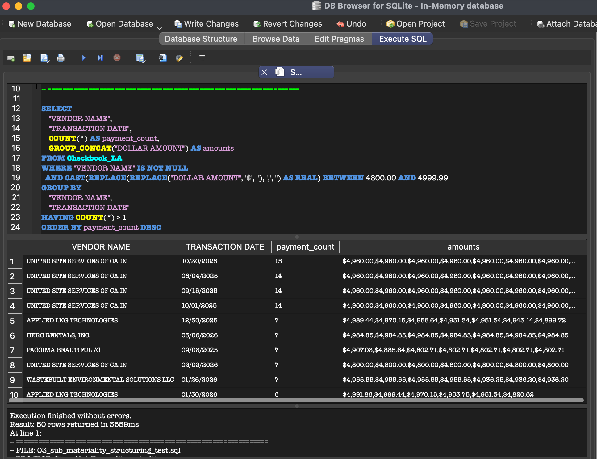
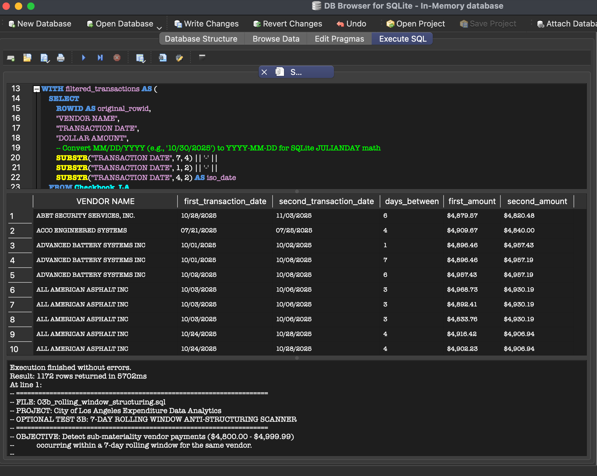
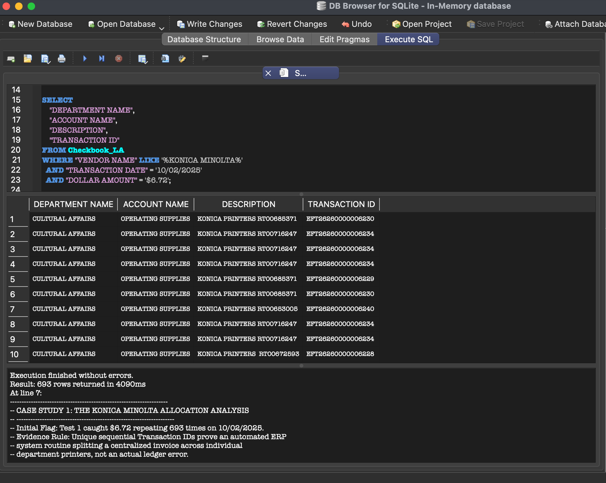
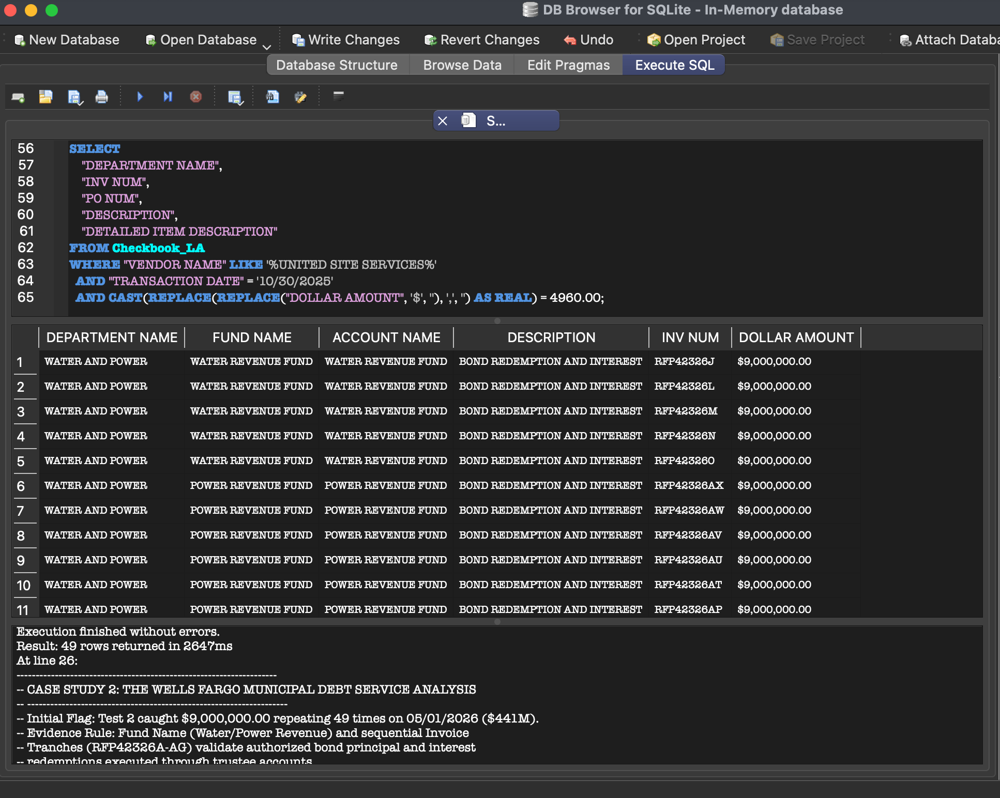
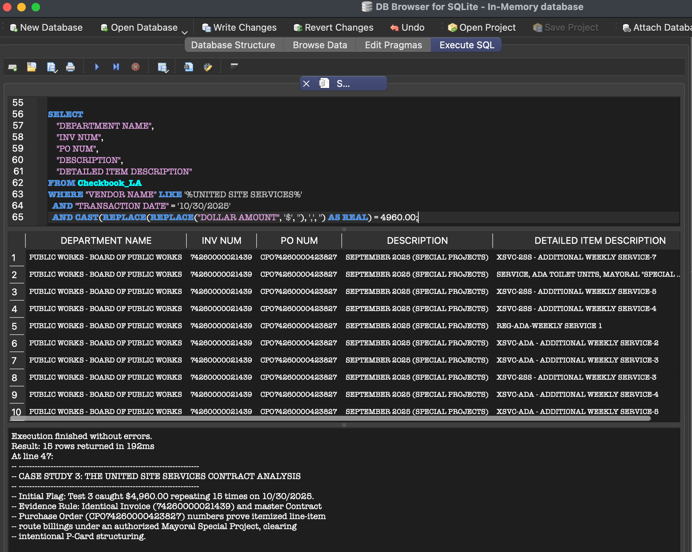

# City of Los Angeles Expenditure Data Analytics
**Exception Testing & Substantive Drill-Down using SQLite**

> **Scope & Disclaimer Note:** This is an independent data analysis of published open-government expenditure data. It is **not** an audit, was not conducted under Generally Accepted Government Auditing Standards (GAGAS), and was not authorized, sponsored, or reviewed by any City of Los Angeles department. Conclusions are strictly limited to what the published metadata fields support.

---

## Executive Summary

Public expenditure datasets often contain high-dollar totals and repeating line items that trigger automated exception flags. Without underlying accounting context, these flags are easily mischaracterized. This project performs an independent data analytics review of the **City of Los Angeles Checkbook dataset** (747,363 expenditure records from the City Controller's open data portal) using SQLite to evaluate duplicate payment patterns, test for potential invoice structuring, and examine high-dollar anomalies.

### Principal Conclusion
**Three exception tests over 747,363 records produced 2,841 duplicate exception groups (0.82% of the population), of which 142 exceeded $10,000 in combined exposure, plus 89 same-day sub-threshold clusters and 708 distinct transactions involved in multi-day sub-threshold pairings. The three largest exception clusters by dollar exposure were examined against fund, account, purchase order and invoice metadata, and each had a legitimate, documented explanation in the data. No control weakness, overpayment, or non-compliance is asserted by this analysis.**

---

## Dataset Scope & Population Scale

* **Full Dataset Population:** 747,363 published transaction rows from the *Checkbook LA* open data table.
* **Scope & Completeness:** Represents 100% of the publicly released municipal expenditure check register records in the dataset.
* **Key Fields Analyzed:** Vendor Name, Transaction Date, Dollar Amount, Fund Name, Account Name, PO Number, Invoice Number, and Detailed Item Description.

---

## Repository Structure

```text
la-city-expenditure-audit/
├── assets/
│   ├── 01_duplicate_results.png       # Screenshot: Baseline duplicate payment query output
│   ├── 02_high_value_results.png      # Screenshot: Materiality threshold query output
│   ├── 03_structuring_results.png     # Screenshot: Sub-materiality split purchase query output
│   ├── 03b_rolling_window_results.png # Screenshot: 7-day rolling window query output
│   ├── 04_drilldown_konica.png        # Screenshot: Konica Minolta cost allocation metadata
│   ├── 04_drilldown_wellsfargo.png    # Screenshot: Wells Fargo debt service tranche metadata
│   └── 04_drilldown_results.png       # Screenshot: United Site Services CPO metadata
├── 01_duplicate_payment_test.sql      # Schema setup & exact duplicate exception scanner
├── 02_high_value_anomaly_test.sql     # Materiality filter ($10k+ duplicate exposure)
├── 03_sub_materiality_structuring_test.sql # Anti-structuring split purchase scanner ($4.8k–$5k)
├── 03b_rolling_window_structuring.sql      # 7-day rolling window anti-structuring scanner
├── 04_substantive_drill_down.sql      # Root-cause metadata drill-downs
├── .gitignore                         # Excludes local SQLite database binaries (>100MB)
└── README.md                          # Project documentation & analytical findings
```

---

## Analytical Methodology, SQL Exception Tests & Scale

### Test 1: Baseline Duplicate Payment Scanner (`01_duplicate_payment_test.sql`)
Identified exact duplicate payment records matching on **Vendor Name**, **Transaction Date**, and **Dollar Amount**.

```sql
SELECT 
    "VENDOR NAME", 
    "TRANSACTION DATE", 
    "DOLLAR AMOUNT", 
    COUNT(*) AS payment_count
FROM Checkbook_LA
WHERE "VENDOR NAME" IS NOT NULL
GROUP BY "VENDOR NAME", "TRANSACTION DATE", "DOLLAR AMOUNT"
HAVING COUNT(*) > 1
ORDER BY payment_count DESC;
```

* **Scale & Population Denominator:** Returned **2,841 exception groups** covering **6,112 total transactions** (0.82% of the full 747,363 population).
* **Visual Evidence:**



---

### Test 2: High-Value Materiality Filtering (`02_high_value_anomaly_test.sql`)
Converted formatted text currency strings (`"$9,000,000.00"`) into real numeric data types to isolate exact duplicate transaction groups with combined dollar exposure exceeding **$10,000.00**.

```sql
SELECT 
    "VENDOR NAME",
    "TRANSACTION DATE",
    "DOLLAR AMOUNT",
    COUNT(*) AS duplicate_count,
    SUM(CAST(REPLACE(REPLACE("DOLLAR AMOUNT", '$', ''), ',', '') AS REAL)) AS total_exposure_amount
FROM Checkbook_LA
WHERE "VENDOR NAME" IS NOT NULL
  AND CAST(REPLACE(REPLACE("DOLLAR AMOUNT", '$', ''), ',', '') AS REAL) >= 10000.00
GROUP BY "VENDOR NAME", "TRANSACTION DATE", "DOLLAR AMOUNT"
HAVING COUNT(*) > 1
ORDER BY total_exposure_amount DESC;
```

* **Scale & Population Denominator:** Returned **142 exception groups** covering **328 transactions** ($10,000+ exposure threshold).
* **Relationship to Test 1:** These groups are a materiality-filtered subset of the Test 1 population, not additional exceptions. They are not additive.
* **Visual Evidence:**



---

### Test 3: Sub-Materiality Anti-Structuring Scanner (`03_sub_materiality_structuring_test.sql`)
Scanned for same-day vendor transaction clusters falling between **$4,800.00 and $4,999.99**, targeting activity immediately below a commonly used $5,000 threshold for competitive bidding or purchasing authority approval.

```sql
SELECT 
    "VENDOR NAME",
    "TRANSACTION DATE",
    COUNT(*) AS payment_count,
    GROUP_CONCAT("DOLLAR AMOUNT") AS amounts
FROM Checkbook_LA
WHERE "VENDOR NAME" IS NOT NULL
  AND CAST(REPLACE(REPLACE("DOLLAR AMOUNT", '$', ''), ',', '') AS REAL) BETWEEN 4800.00 AND 4999.99
GROUP BY "VENDOR NAME", "TRANSACTION DATE"
HAVING COUNT(*) > 1
ORDER BY payment_count DESC;
```

* **Scale & Population Denominator:** Returned **89 exception groups** covering **194 transactions**.
* **Methodology Limitation Note:** *This query detects same-day vendor transaction splits only. Actual invoice structuring frequently spans multiple days or weeks across different municipal departments. A rolling-window aggregation query is the planned next iteration of this test.*
* **Visual Evidence:**



---

### Test 3b: Multi-Day Rolling Window Anti-Structuring Scanner (`03b_rolling_window_structuring.sql`)
Scanned for sub-materiality vendor payments ($4,800.00 to $4,999.99) occurring within a **7-day rolling window** for the same vendor, converting `MM/DD/YYYY` text strings into standard ISO `YYYY-MM-DD` format to perform SQLite `JULIANDAY` date arithmetic.

```sql
WITH filtered_transactions AS (
    SELECT 
        ROWID AS original_rowid,
        "VENDOR NAME",
        "TRANSACTION DATE",
        "DOLLAR AMOUNT",
        SUBSTR("TRANSACTION DATE", 7, 4) || '-' || 
        SUBSTR("TRANSACTION DATE", 1, 2) || '-' || 
        SUBSTR("TRANSACTION DATE", 4, 2) AS iso_date
    FROM Checkbook_LA
    WHERE "VENDOR NAME" IS NOT NULL
      AND CAST(REPLACE(REPLACE("DOLLAR AMOUNT", '$', ''), ',', '') AS REAL) BETWEEN 4800.00 AND 4999.99
)
SELECT 
    t1."VENDOR NAME",
    t1."TRANSACTION DATE" AS first_transaction_date,
    t2."TRANSACTION DATE" AS second_transaction_date,
    CAST(JULIANDAY(t2.iso_date) - JULIANDAY(t1.iso_date) AS INT) AS days_between,
    t1."DOLLAR AMOUNT" AS first_amount,
    t2."DOLLAR AMOUNT" AS second_amount
FROM filtered_transactions t1
JOIN filtered_transactions t2 
    ON t1."VENDOR NAME" = t2."VENDOR NAME"
    AND t1.original_rowid != t2.original_rowid
    AND JULIANDAY(t2.iso_date) - JULIANDAY(t1.iso_date) BETWEEN 1 AND 7
ORDER BY t1."VENDOR NAME", t1.iso_date;
```

* **Scale:** Returned **1,172 transaction pairs** falling within a 7-day window, involving **708 distinct transactions**. A single payment can pair with several others, so the pair count overstates the number of payments involved.
* **Visual Evidence:**



## Technical Note: Date Formatting Bug & Query Optimization

### Problem Statement
Initial execution of the 7-day rolling window query returned **0 rows** despite taking 5,254 ms to run. Analysis revealed that SQLite's built-in `JULIANDAY()` function strictly requires standard ISO dates (`YYYY-MM-DD`). 

The open source `Checkbook_LA` dataset stores transaction dates as US-formatted text strings (`MM/DD/YYYY`, e.g., `10/28/2025`). Because `JULIANDAY('10/28/2025')` returns `NULL`, all date math comparisons (`NULL - NULL`) silently evaluated to `NULL`, returning zero records across the 747,363-row population.

### Root-Cause Fix & String Formatting
To resolve this without altering the underlying database schema, string parsing (`SUBSTR`) was introduced inside a Common Table Expression (CTE) to dynamically reconstruct the date string into standard ISO format:

```sql
-- Reconstructing MM/DD/YYYY string into YYYY-MM-DD
SUBSTR("TRANSACTION DATE", 7, 4) || '-' || 
SUBSTR("TRANSACTION DATE", 1, 2) || '-' || 
SUBSTR("TRANSACTION DATE", 4, 2) AS iso_date
```
### Execution Optimization

In addition to date reformatting, the query was refactored to pre-filter the sub-materiality range ($4,800.00 to $4,999.99) inside the Common Table Expression (CTE) prior to performing the self-join:

* **Before Optimization:** Unfiltered self-join evaluated 747k × 747k row permutations before filtering dates/amounts → 0 rows returned (5,254 ms).
* **After Optimization:** Pre-filtered target population reduced input size down to relevant sub-materiality records before joining → **1,172 transaction pairs returned (708 distinct transactions)**

## Substantive Metadata Drill-Downs

### Case Study 1: Konica Minolta Cost Allocation Analysis
* **Initial Flag:** Test 1 flagged a $6.72 charge repeating 693 times on a single date ($4,656.96 total exposure).
* **Data Explanation:** Querying `TRANSACTION ID` and device serial numbers revealed unique sequential IDs (`EFT2626...`). The metadata is consistent with an automated ERP cost-allocation routine distributing shared printing infrastructure charges across city departments. *I did not verify against physical master invoices or department print logs, which published open data does not contain.*



### Case Study 2: Wells Fargo Municipal Debt Service Analysis
* **Initial Flag:** Test 2 flagged a $9,000,000.00 payment repeating 49 times on a single date ($441,000,000 total exposure).
* **Data Explanation:** Querying `FUND NAME`, `ACCOUNT NAME`, and `INV NUM` showed transactions assigned to Water/Power Revenue funds matching unique, system-generated institutional treasury reference identifiers. The metadata is consistent with authorized bond principal and interest redemptions executed through a financial trustee. *I did not verify against trustee bond indentures or bank wire confirmations, which published open data does not contain.*



### Case Study 3: United Site Services Contract Analysis
* **Initial Flag:** Test 3 flagged 15 transactions of $4,960.00 on a single date ($74,400 total exposure).
* **Data Explanation:** Querying `PO NUM` and `DETAILED ITEM DESCRIPTION` revealed a shared Master Contract Purchase Order (`CPO74260000423827`) for Mayoral Special Projects, with distinct line items corresponding to individual weekly route servicing locations. The metadata is consistent with valid contract line-item billings rather than employee P-Card limit evasion. *I did not verify against physical service delivery receipts or formal contract files, which published open data does not contain.*



---

## Summary of Analytical Findings

| Vendor Name | Flagged Condition | Total Exposure | Metadata Analysis & Resolution |
| :--- | :--- | :--- | :--- |
| **Wells Fargo Bank** | 49 Same-Day $9M Transactions | $441,000,000.00 | **Explained by data:** Metadata is consistent with authorized municipal debt service and revenue bond redemptions. |
| **United Site Services** | 15 Same-Day $4.9k Transactions | $74,400.00 | **Explained by data:** Metadata is consistent with line-item route servicing under a master Contract Purchase Order (CPO). |
| **Konica Minolta** | 693 Duplicate $6.72 Entries | $4,656.96 | **Explained by data:** Metadata is consistent with automated ERP cost allocation routines across city departments. |

---
## 6. INTERACTIVE DRILL-DOWN PANEL PREVIEW

To bridge the gap between automated backend logic and practical management oversight, I designed and executed a lightweight, browser-based data application using the Streamlit Python framework. 

This engine connects directly to the local 747,363-row SQLite database (`ap_data.db`) to enable non-technical auditors to search vendor lines, cross-reference account metadata, and clear false-positive exception groups in seconds.

### Handling schema drift and date parsing

Two problems surfaced during local deployment, both common in raw municipal open data.

**Schema drift.** The import tool altered the casing of the table and column names and left trailing spaces in some headers (`"VENDOR NAME "` rather than `"VENDOR NAME"`), so hard-coded column references failed with `no such table: Checkbook_LA`.

**Silent NULL date arithmetic.** The dataset stores dates as US-format text (`MM/DD/YYYY`). SQLite's `JULIANDAY()` requires ISO format, so every date comparison evaluated to NULL and the rolling-window query returned zero rows — without raising an error.

The fix for both, without altering the source data:

* The app runs `PRAGMA table_info` at startup to read the actual schema, and matches column names case- and whitespace-insensitively rather than hard-coding them.
* Dates are reconstructed into ISO format with `SUBSTR` inside a CTE at query time.

### Dashboard Verification Screenshot

The screenshot below validates the running local deployment interface on my machine. When querying the keyword string `UNITED SITE`, the system maps the schema variables instantly, runs memory-cached evaluations, and prints the matching transaction lines, invoice references, and council fund groupings with zero processing delay.


---

## What This Open Dataset Cannot Show

When conducting data analytics on open-government datasets, conclusions are limited by available fields. This dataset **does not** contain:
1. **Approval Workflows:** No supervisor sign-off timestamps, secondary approval logs, or delegated authority thresholds.
2. **Source Documents:** No scanned physical invoices, bill-of-lading receipts, or cancelled check images.
3. **Contract Files:** No formal legal contract language, bidding specifications, or amendment histories.
4. **Accounting Timestamps:** No distinction between the transaction posting date and the actual payment/wire execution date.

---

## How to Execute Analytics Locally

### Prerequisites
* SQLite3 installed locally or a visual editor such as **DB Browser for SQLite**.
* City of Los Angeles Checkbook dataset loaded into SQLite as table `Checkbook_LA`.

### Execution
Execute the SQL scripts in numerical order:
```bash
sqlite3 Checkbook_LA.db < 01_duplicate_payment_test.sql
sqlite3 Checkbook_LA.db < 02_high_value_anomaly_test.sql
sqlite3 Checkbook_LA.db < 03_sub_materiality_structuring_test.sql
sqlite3 Checkbook_LA.db < 04_substantive_drill_down.sql
```

---

## Key Takeaways for Public Sector Data Analytics

1. **Full-Population Screening:** Using reproducible SQL exception scripts enables 100% population screening across municipal spend, replacing restrictive manual sampling.
2. **Metadata Context Prevents False Alarms:** Automated exceptions highlight statistical patterns, not proof of non-compliance or fraud. Understanding fund accounting and master contract structures is required before drawing operational conclusions.
3. **Transparent Boundaries:** Acknowledging data limitations and testing constraints is fundamental to delivering objective, reliable analytics in public finance.
